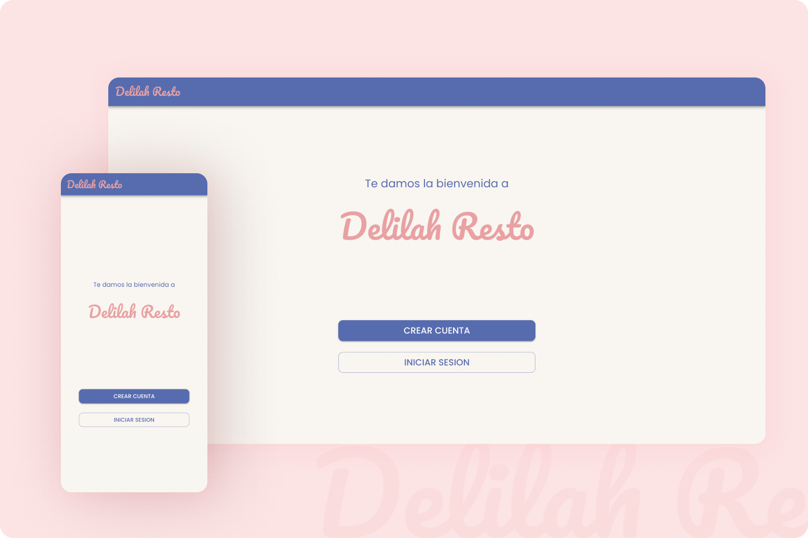

# Delilah Resto - Front end :woman_cook: :sparkling_heart:  [Live Demo](https://delilah-resto-iota.vercel.app/)

\
\
Habiendo desarrollado previamente el backend de una plataforma de pedidos online para un restaurante, como proyecto final de la carrera Desarrollo Full Stack en Acamica, me propuse el desafío de diseñar la interfaz del usuario y desarrollar el front end, completando así el desarrollo full stack de la aplicación.

*Este proyecto sigue en desarrollo. Podes ver los avances haciendo click en "Live Demo".* :construction:

## Diseño responsive
*Mobile First*
\

## Screenshots:
###### Bienvenida: Registro de usuario e inicio de sesión

***

###### Inicio: Saludo personalizada y buscador de productos

***

###### Categorias: Explora las distintas categorias de productos

***

###### Productos por categoria: Muestra los productos por categorías

***

###### Producto: Detalle del producto, selecciona la cantidad de unidades a agregar a tu pedido

***

###### Favoritos: Explora tus productos favoritos guardados

***

###### Pedido: Detalle del pedido, infomacion del usuario y metodo de pago.

***

###### Estado del pedido: Sigue el estado del pedido actual y accede al detalle del mismo.

## Funcionalidades:
- Registro de usuario nuevo.
- Inicio de sesión en la plataforma.
- Buscador de productos.
- Visualización de productos por categorías.
- Visualización productos individualmente.
- Recomendación de menu.
- Acción para productos favoritos.
- Acción para agregar productos al carrito de compras.
- Carrito de compras editable.
- Seguimiento de pedido.
- Acceso al historial de pedidos.
- Acceso a productos favoritos.
- Panel de administrador :construction:

## API:
Integración con API desarrollada previamente en este repositorio [Link al repositorio](https://github.com/ludmila-niec/Delilah_resto)

## Tecnologías utilizadas:
✨ React.js

✨ Redux

✨ React Router

✨ Material-ui

✨ Lottie

✨ Axios

